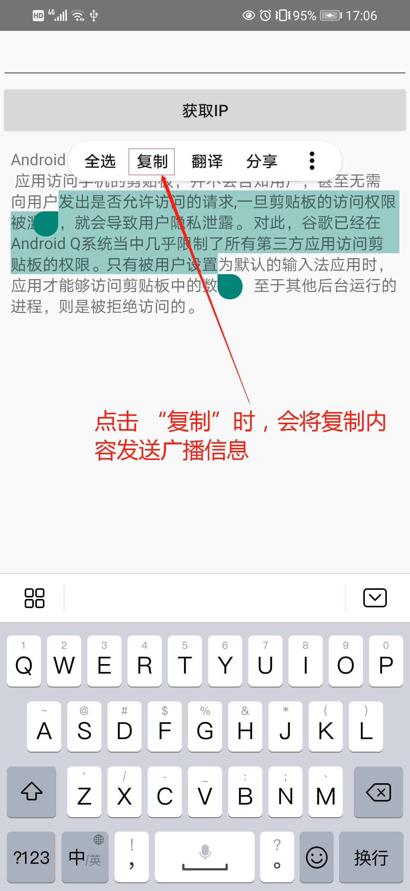
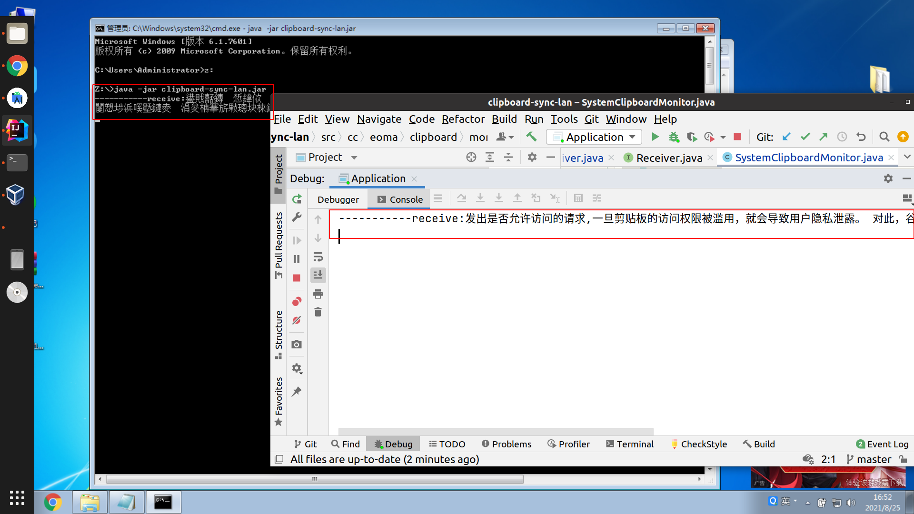

## 概述

### Android 应用: [clipboard-sync-lan-app](https://github.com/Gomaxx/clipboard-sync-lan-app)

本人工作电脑 Ubuntu + VirtualBox（Win 7），Win 7 中跑部分特殊软件（QQ、微信、钉钉 等），由于其他因素，需要手机热点（或手机桥接网络），经常需要在三端(手机)同步信息，采用方式 Ubuntu 跟 VirtualBox 间，设置共享剪切板（但时有失效），然后在虚拟机中通过微信或 QQ 发送给自己，来进行手机端同步，操作起来太过繁琐，因此编写此工具用以在局域网内共享剪切板信息。

主要工作：
1. 监听系统剪切板，当剪切板有新信息时，发送局域网广播信息
2. 接收广播信息，将信息设置到系统剪切板上

注：暂时只支持剪切板中字符的共享，后续考虑支持文件共享; 

热点（或桥接）网络中的设备用 255.255.255.255 进行广播，热点（或桥接）手机广播地址使用 192.168.43.255

操作示例：
1. 任何一端复制信息（或手机打开应用时检测剪切板有信息）时，会将剪切板中的信息发送广播
2. 广播接收端，接受到信息后会将信息设置到系统剪切板中
3. 在需要的地方直接粘帖即可

## 参考
https://github.com/szuwest/Recorder
